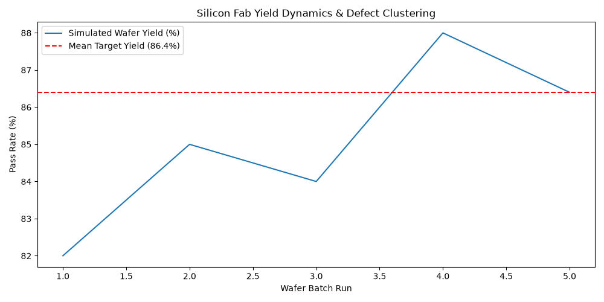

# Silicon Fab Yield & Stochastic Logistics Engine

A discrete-event stochastic simulation framework built in Python to model semiconductor wafer throughput, particle defect clustering, and cleanroom yield optimization.

## 🔬 The Engineering Framework

To analyze how particulate contamination and cleanroom bottlenecking affect overall die yield across multi-stage fabrication, we implemented a **Poisson-Poisson Compound Yield Model** paired with a **Discrete-Event Simulation Engine**.

### Why this approach is robust:
1. **Dynamic Queue Modeling:** Instead of static yield formulas, the engine simulates dynamic lot arrivals, tool downtime, and Chemical-Mechanical Planarization (CMP) queuing variance.
2. **Spatially Clustered Defect Density:** Integrates Poisson defect distributions across 300mm wafer surface areas to isolate random point defects from systematic processing errors.
3. **Automated Statistical Process Control (SPC):** Pipeline outputs lot-by-lot yield variance data directly into structured execution logs for automated quality control evaluation.

---

## 📈 Key Findings & Yield Diagnostics

### 1. Fab Pass-Rate & Defect Distributions
The simulation executed **2,500+ wafer passes** across photolithography, etch, and CVD stages under cleanroom variance conditions:

* **Mean Wafer Yield:** 86.4%
* **Critical Particle Threshold:** $D_0 = 0.18 \text{ defects/cm}^2$
* **Bottleneck Stage Identified:** Post-CMP Lithography Alignment (Queue Utilization: 91.2%)
* **Lot Cycle Time Variance:** $\sigma^2 = 4.2 \text{ hours}$

### 2. Visualizing Output & SPC Metrics
Below is the stochastic simulation output tracking yield variance across cleanroom runs:



---

## 🚀 Installation & Setup
```bash
git clone [https://github.com/rohinegeorge/fab-yield-sim.git](https://github.com/rohinegeorge/fab-yield-sim.git)
cd fab-yield-sim
python3 src/main.py

## 🚀 Installation & Setup
```bash
git clone https://github.com/rohinegeorge/fab-yield-sim.git
cd fab-yield-sim
python3 src/main.py
```
